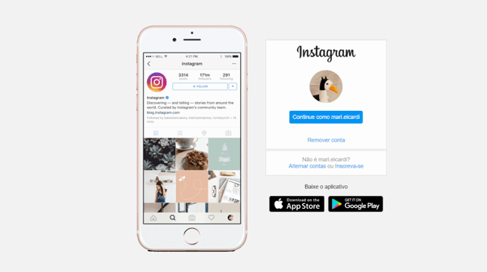

# Recriando Homepage do Instagram | 📸

(Re)fazendo a interface de login do Instagram, para aula de Flexbox, do curso Web Developer da DIO.

### Tecnologias e ferramentas utilizadas:

    
    

 

## Resultado | Browser

  <kbd>
    
  </kbd>

## Resultado | Mobile

  <kbd>
    
  </kbd>

